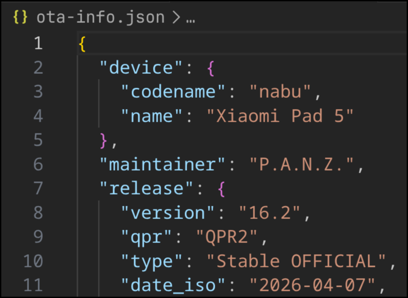

## Auto-Banner Generator (WIP)

The purpose of this script is to streamline release-related work by reading ota-info.json and populating banner-template.png with the info using ImageMagick. Along with it, a Telegram post is generated as well.

## How to use
1. Edit ota-info.json
2. ./generate_release.sh

(__chmod +x generate_release.sh__)

## Example

## Special Thanks
- [Geno](https://github.com/genoxci-dev) for the banner!